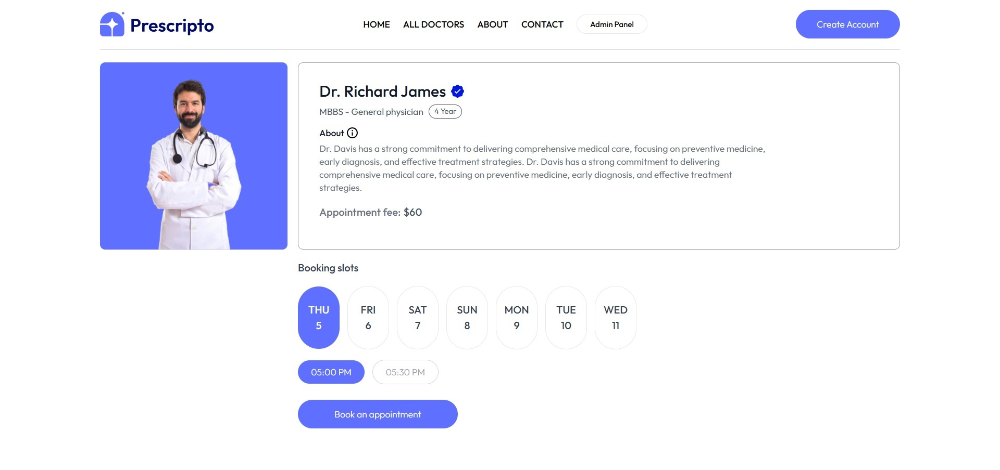
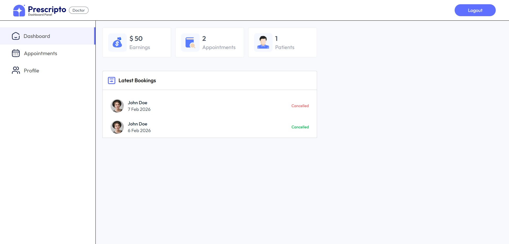
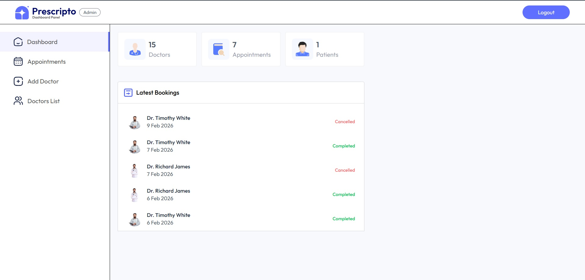

# 🩺 Doctor Appointment Booking System

A full-stack doctor appointment booking platform where patients can browse doctors, book appointments, and pay online, while admins manage doctors, schedules, and bookings through a dedicated dashboard.  
Built using React, Node.js/Express, and MongoDB with a clean monorepo architecture.

---

## 🚀 Features

- 🔐 User Authentication (Login / Register)
- 👨‍⚕️ Browse doctors by specialization
- 📅 Book appointments with time slots
- 💳 Secure online payments via Razorpay
- 📂 Patient dashboard to manage bookings
- 🛠 Admin dashboard to manage doctors & appointments
- 📱 Fully responsive (mobile friendly UI)
- ⚡ Separate Frontend, Admin, and Backend apps

---

## 🛠 Tech Stack

### Frontend
- React (Vite)
- Tailwind CSS

### Backend
- Node.js
- Express.js
- MongoDB

### Payments
- Razorpay

---

## ⚙️ Local Setup

### 1️⃣ Clone the repository
```bash
git clone https://github.com/tanujgupta18/Doctor-Appointment-Booking-System
cd Doctor-Appointment-Booking-System
````

---

### 2️⃣ Start Frontend

```bash
cd Frontend
npm install
npm run dev
```

---

### 3️⃣ Start Admin Panel

```bash
cd Admin
npm install
npm run dev
```

---

### 4️⃣ Start Backend

```bash
cd Backend
npm install
npm run server
```

---

## 🔑 Environment Variables

### Backend (.env)

```
MONGO_URI=
JWT_SECRET=
RAZORPAY_KEY_ID=
RAZORPAY_KEY_SECRET=
CLOUDINARY_NAME=
CLOUDINARY_API_KEY=
CLOUDINARY_SECRET_KEY=
CURRENCY=
```

### Frontend/Admin (.env)

```
VITE_BACKEND_URL=
VITE_ADMIN_URL=
```

---

## 🌐 Live Demo

| App | Link |
|-----|------------------------------|
| Frontend | https://prescripto-tg.vercel.app |
| Admin | https://prescripto-admin-tg.vercel.app |

---

## 📸 Screenshots

### 🏠 Home


### 📅 Booking Page


### 👨‍⚕️ Doctor Dashboard


### 🛠 Admin Dashboard

